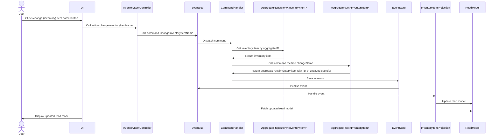
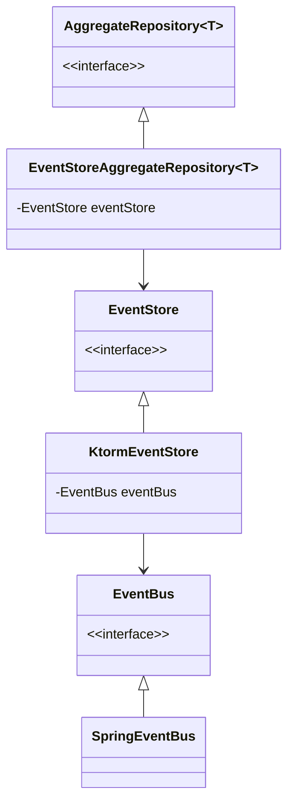

+++
draft = true
author = "Simon Schoof"
title = "The slightly more complex thingy: A CQRS/ES backend in Kotlin"
date = "2024-07-19"
description = "A CQRS/ES backend in Kotlin with Spring Boot, Spring events, and an embedded database"
tags = [
    "cqrs",
    "event-sourcing",
    "domain-driven-design", 
    "kotlin",
    "spring-boot",
    "embedded-database"
]
references = [
    { name = "simplestpossiblething", url = "https://github.com/gregoryyoung/m-r/tree/master" },
    { name = "cqrs-task-based-uis-event-sourcing", url = "https://gist.github.com/simonschoof/74e155447fbc2ac47b0f7c0bb5a5f778" }
]
+++

In this post, we will build an application using Kotlin, Spring Boot, Spring events, and an embedded database showcasing an Command Query Responsibility Segregation (CQRS) and Event Sourcing (ES) architecture. 


## Introduction

We will implement a simple CQRS/ES architecture to demonstrate how to structure a backend application with these concepts. The application builds upon the C# implementation of [<sup>[1](#ref-1)</sup>], but uses Kotlin and Spring Boot instead of C# and .NET and adds a (embedded) PostgreSQL database and Spring events to the mix. A frontend application is also part of the codebase, but is not the focus of this post. The frontend application is build using Kotlin Multiplatform Compose and is more of a proof of concept. For the domain side of the application we also follow the original SimpleCQRS project, and implement a simple inventory management system with only one aggregate root, the `InventoryItem`. The application is structured in a way that it can be easily extended with more aggregate roots, commands, events, and projections. Nevertheless the application is not production ready and lacks many features like security, monitoring, proper error handling and logging, etc. The focus of the project is to demonstrate the concepts of CQRS and ES and how to implement them in Kotlin with Spring Boot. 

In this post we we will give a brief introduction of the underlying concepts of Domain Driven Design (DDD), CQRS and ES. Please note, that each of the cocepts is very complex on its own and we will only scratch the surface of each of them.
In the following section we will explain the flow and structure of the application. We will then introduce the technologies used in the project and give a brief overview of the codebase structure. We will then explain the components of the codebase and how they interact with each other. Finally, we will give a brief outlook on the next post in this series, which will focus on testing the application.

As mentioned before, the application is not production ready and lacks many features. But there are production ready frameworks avaible for CQRS/ES like Axon Framework and Marten. In addition to that you can find more implementations of CQRS/ES in Kotlin or .NET on the internet. The ones I found are also based on the SimpleCQRS project but are using a different implementation to the one I used in my project. 

## Concepts

In this section we will give a brief introduction to the underlying concepts used in the implementation of the project. We will only scratch the surface of each concept and give a short overview. Every concept could probably fill a whole book or at least a blog post on its own. So please be aware that further reading on each concept is highly recommended. Also note that the explanations are very simplified and lack strictness in the definitions.

##### Domain Driven Design (DDD)

The first time I heard about CQRS and Event Sourcing was in the context of Domain Driven Design (DDD). DDD is an approach of developing software that focuses on the domain and the business logic of the application. It was introduced 2003 by Eric Evans in his seminal book Domain-Driven Design: Tackling Complexity in the Heart of Software[<sup>[2](#ref-2)</sup>]. Since the publication of the book, DDD has gained a lot of popularity and is now a widely used approach in software development, where a lot of other resources like books, blog posts, and videos are available. The book from Eric Evans itself is thereby split into two part. The first part is about desinging and implementing the domain model with the so called tactical patterns like Aggregates, Repositories, Factories, and Domain Events. The second part is about the strategic patterns like Bounded Contexts, Context Maps, and Shared Kernel. Whereas the second part is regarded as the more important one by many people and Eric Evans himself. As we are focussing on an implementation example we will only describe some of the pattersn used in the project. 
Going forward we will go through the small list of tactical patterns used in the project.


**Aggregates and Aggregate Roots**

We will start with Aggregates and the Aggregate Root, which is also the main abstraction used in the implementation of the project. An Aggregate is a cluster of domain objects (Entities and Value Objects) that can be treated as a single unit. The Aggregate Root is the main entity of the Aggregate and is the only entity that can be accessed from outside the Aggregate. The Aggregate Root is responsible for maintaining the consistency of the Aggregate. In the project we have only one Aggregate the 
InventoryItem, which is at the same time the Aggregate Root.

**Factories**

A Factory in DDD is ressponsible for creating an Aggregate in a consistent state. The Factory of DDD is not the same as the Factory pattern from the Gang of Four. Of course the Factory pattern can be used to implement a Factory in DDD, but the Factory in DDD is more about the concept of creating an Aggregate in a consistent state. In the project we simply have the constructor of the InventoryItem and an companion object invoke function as a Factory.

**Repositories** 

A Repository in DDD is responsible for loading and saving Aggregates. It is also an abstraction that hides the details of the underlying data store from the domain, when working with an dependency inversion principle (DIP) compliant architecture (see below). Also here it is important to note, that when loading and saving an Aggregate the whole Aggregate is loaded and saved in a consistent state. In this project we have the AggregateRepository, which has a dependency to the EventStore and is responsible for loading and saving the events of the InventoryItem Aggregate. As we are using Event Sourcing the Repository is not responsible for loading and saving the state of the Aggregate, but the events that lead to the current state of the Aggregate. 

**Domain Events**

A core concept in our implementation of the project are Domain Events. Domain Events are events that are published when there was a change in the Aggregate. The event names are denoted in the past tense and describe what happened in the Aggregate. The events are stored in the EventStore and are used to rebuild the state of the Aggregate, hence the name Event Sourcing. The events are also used to update the Read Side of the application via Projections. We are going with the definintion of Marten for Projections as any strategy for generating "read side" views from the raw events. Domain Events are not used to integrate with other systems or services, therefore so called Integration Events are used. 


##### Dependency Inversion Principle (DIP) compliant architecture

To isolate the domain from the infrastructure and to make the domain independent of the infrastructure, we are using the Dependency Inversion Principle (DIP). This is the underlying principle for many architectures like the Hexagonal Architecture, Onion Architecture, or Clean Architecture. The DIP states that high-level modules should not depend on low-level modules. Both should depend on abstractions. We will see how this is implemented in the project later on in this post. If isolating the domain from the infrastructure is a good practice is still a matter of debate, as the isolation comes with a cost of higher complexity in architecture and code. There are voices with pleding for beeing one with the layers and not to isolate the domain from the infrastructure. To use an implementation with a rich domain model is also a choice that has to be made as this depends on the complexity of the domain and the business logic. There are other architectural patterns like Transaction Script or Table Module that can be more suitable for simple domains and business logic. Nevertheless, we are going with the DIP compliant architecture in this project.

##### Dependency Injection (DI)

In the previous section we talked about the DIP compliant architecture and how high and low level modules should depend on abstractions. We will leverage Dependency Injection (DI) to fulfill this principle and decouple the domain from the infrastructure. DI is a technique where one object supplies the dependencies of another object instead of the object creating the dependencies itself. This is done by injecting the dependencies into the object that needs them. This can be done by constructor injection, setter injection, or interface injection, but we are only using constructor injection in the project. 
This will also help us with the testing of the application where we can test the domain logic in isolation and provide mock implementations for the infrastructure dependencies. We will talk more about testing in the next post of this blog. 

##### Command Query Responsibility Segregation (CQRS)

CQRS is one of the two main architectural patterns we want to demonstrate in the implementation of the project. CQRS is an extension of the Command Query Separation (CQS) principle, which was introduced by Bertrand Meyer in his book Object-Oriented Software Construction. CQS states that a method should either change the state of an object or return a result, but not both. CQRS takes this principle further and segregates the read and write operations of an application into two different parts of the application. In its simplest form, CQRS 
> is simply the creation of two objects where there was previously only one. 

Whereas one object is responsible for handling the commands and changing the state of the application, the so called write side of the application. The other object is responsible for handling the queries and returning the state of the application, the so called read side of the application. For the beginning there is nothing more to CQRS than that, as also described by Greg Young in his blog post [<sup>[3](#ref-3)</sup>]. Nevertheless CQRS enables us to optimize the read and write operations of an application independently and to introduce other interesting patterns like Event Sourcing, Task Based UIs and Eventual Consistency, even though these are not part of CQRS itself.

##### Event Sourcing (ES)

The next pattern we will have a closer look at in the implementation of the project is Event Sourcing. Event Sourcing is a pattern where the state of an application is determined by a sequence of events. Instead of storing the current state of an object, we store the events that lead to the current state of the object. This has the advantage that we can rebuild the state of the object at any point in time by replaying the events. Combined with CQRS, we can use the events to update the read side of the application via Projections. We are following the definition from Marten for Projections as any strategy for generating "read side" views from the raw events.  

## Flow and application/package structure

##### Package structure

As mentioned above in the Dependency Inversion Principle (DIP) compliant architecture section, we are using the DIP to isolate the domain from the infrastructure. We are using packages to structure the application in a way that the domain is separated from the infrastructure. This means, that there are no dependencies from other packages to the domain package. 

The domain is the core of the application and contains the building blocks as abstractions. The building blocks are: 

- AggregateRoot
- AggregateRepository
- EventBus
- EventStore
- Command
- Event

In addition to the building blocks we have the domain logic in the InventoryItem class and the events and commands in the domain package.

The infrastructure package contains the implementations of the building blocks for the persistence, the event store and the event bus. You can also find the InventoryItemController in the infrastructure package, which is responsible for handling the API calls from the frontend application.

The application package contains the CommandHandler.
The ReadModels and the Projections are locatet in the readmodel package.

```
cqrs-es
├── application
├── config
├── domain
│   ├── buildingblocks
├── infrastructure
│   ├── persistence
│   ├── web
└── readmodels
```

##### Flow of the application

So as we have seen in the previous section we have a lot of concepts and patters that we are using to structure the application. Before we go into the details of the implementation we will give a more coarse grained overview of the overall flow and the structure of the application. 

The application lets the user manage inventory items. The user can create an inventory item, change the name of the inventory item, check in and check out items from the inventory item, set the maximum quantity of the inventory item, and deactivate the inventory item. The user can also query the read side of the application to get the current state of the inventory item. This is the same as in the original SimpleCQRS project. A extended domain example in Kotlin can be found here from ... 

To give an overview of what is happening in the application we will go through the flow of the application. 
Starting with the user sending a command to the application. The command is handled by a CommandHandler, which is responsible for handling the command and changing the state of the application. The CommandHandler uses the AggregateRepository to load the Aggregate, which is the InventoryItem in our case, and to save the events that lead to the current state of the Aggregate. The events are stored in the EventStore. The CommandHandler then publishes the events to the EventBus. The EventBus is responsible for publishing the events to the EventListeners. The EventListeners are responsible for updating the ReadModel of the application. The ReadModel is the read side of the application and is used to query the current state of the application. The ReadModel is updated via Projections. The Projections are responsible for updating the ReadModel with the events that are published by the EventBus. The ReadModel is then used to query the current state of the application.



##### Walkthtrough the code

As we have seen sequence diagram above there are multiple components involved to handle a command and update the read model. We will now go through the code of the components following the flow of the sequence diagram. We will not show the UI part and start directly with the InventoryItemController. The first thing is to send a POST request to the InventoryItemController with the command to change the name of the InventoryItem. 

```kotlin
@PostMapping(
    value = ["/api/changeInventoryItemName"],
    consumes = [MediaType.APPLICATION_JSON_VALUE],
    produces = [MediaType.APPLICATION_JSON_VALUE]
)
fun changeInventoryItemName(@RequestBody changeInventoryItemNameRequest: ChangeInventoryItemNameRequest) {
    val changeInventoryItemName = ChangeInventoryItemName(
        UUID.fromString(changeInventoryItemNameRequest.aggregateId),
        changeInventoryItemNameRequest.newInventoryItemName
    )
    eventBus.send(changeInventoryItemName)
}
```

Here we can see that we have the event bus injected into the InventoryItemController and that we construct the command ChangeInventoryItemName from the request body. We then send the command to the event bus via the send method.

The event bus itself is defined as an interface in the domain package of the application and has only two methods, one for publishing events and one for sending commands. 

```kotlin
interface EventBus {
    fun publish(event: Event)
    fun send(command: Command)
}
```
The implementation of the event bus is in the infrastructure package and is using Spring events for sending commands and publishing events. 

```kotlin
@Component
class SpringEventBus(val publisher: ApplicationEventPublisher): EventBus {

    override fun publish(event: Event) {
        publisher.publishEvent(event)
    }

    override fun send(command: Command) {
        publisher.publishEvent(command)
    }

}
```

The command is then dispatched to the InventoryItemCommandHandlers class<cite>[^1]<cite>. In the InventoryItemCommandHandlers class the command is handled and the state of the application is changed when the command is valid and the state of the Aggregate is consistent otherwise the command is rejected. The handling of a command generally follows the same pattern:

1. Load the Aggregate from the AggregateRepository
2. Call the command method on the AggregateRoot
3. Save the events to the EventStore
4. Publish the events to the EventBus

For the ChangeInventoryItemName command the InventoryItemCommandHandlers class looks like this:

```kotlin 
@Component
@Transactional
class InventoryItemCommandHandlers(private val aggregateRepository: AggregateRepository<InventoryItem>) {

    @EventListener
    fun handle(command: ChangeInventoryItemName) {
        aggregateRepository.getById(command.aggregateId).ifPresent {
            it.changeName(command.newName).hasChanges().apply { 
                aggregateRepository.save(it) 
            }
        }
    }

    // other command handlers
}
```

The changeName method is defined in the InventoryItem class and is responsible for changing the name of the InventoryItem. The changeName method is also responsible for creating the ChangeInventoryItemName event and returning the InventoryItem with the unsaved event. The InventoryItem class is the AggregateRoot and is responsible for maintaining the consistency of the Aggregate. 

```kotlin
fun changeName(newName: String): InventoryItem = applyChange(
    InventoryItemNameChanged(
        this.baseEventInfo(),
        newName = newName
    )
)
```

As we can see in the code above the changeName method is creating the InventoryItemNameChanged event and is calling the applyChange method. The applyChange method is defined in the AggregateRoot interface and is responsible for applying the event, which defines the changes made to the Aggregate, to the Aggregate implementation. The applyChange method also stores the event in the Aggregates changes list which is tracking the unsaved changes made to the Aggregate. The AggregateRoot interface is the core abstraction in the simplest possible thing project and is defined as follows:

```kotlin
interface AggregateRoot<T> where T : AggregateRoot<T> {

    // properties

    fun applyChange(event: Event, isNew: Boolean = true): T =
        applyEvent(event).apply { if (isNew) changes += event }

    fun applyEvent(event: Event): T

    fun hasChanges() = changes.isNotEmpty()

    // more functions
}
```
As we can the in AggregateRoot interface in the applyChange method the applyEvent method is called to apply the event to the Aggregate implementation. The applyEvent method is defined in the implementation of the AggregateRoot, which is the InventoryItem in our case. In the implementation of the applyEvent method in the InventoryItem class all events that can be applied to the InventoryItem are handled. The applyEvent method in the InventoryItem class is responsible for changing the state of the InventoryItem based on the event that is applied to the InventoryItem and returning the InventoryItem with the new state, that means the the properties of the InventoryItem are updated to their new values. 

```kotlin
data class InventoryItem(
    override val id: Optional<AggregateId> = Optional.empty(),
    override val changes: MutableList<Event> = mutableListOf(),
    override val clock: Clock = Clock.systemUTC(),
    private val name: Optional<String> = Optional.empty(),
    private val isActivated: Boolean = false,
    private val availableQuantity: Int = 0,
    private val maxQuantity: Int = Int.MAX_VALUE,
) : AggregateRoot<InventoryItem> {

    override fun applyEvent(event: Event): InventoryItem = when (event) {
        is InventoryItemCreated -> copy(
            id = Optional.of(event.aggregateId),
            name = Optional.of(event.name),
            availableQuantity = event.availableQuantity,
            maxQuantity = event.maxQuantity,
            isActivated = true
        )
        is InventoryItemNameChanged -> copy(name = Optional.of(event.newName))
        is InventoryItemsRemoved -> copy(availableQuantity = event.newAvailableQuantity)
        is InventoryItemsCheckedIn -> copy(availableQuantity = event.newAvailableQuantity)
        is InventoryItemDeactivated -> copy(isActivated = false)
        else -> this
    }

    fun changeName(newName: String): InventoryItem = applyChange(
        InventoryItemNameChanged(
            this.baseEventInfo(),
            newName = newName
        )
    )

    // other methods
}
```

The InventoryItem class is a Kotlin data class and is treated as immutable so that we always return a copy of the class from the applyEvent method. This is discussed more in detail in the conventions and workarounds part of this section.

After we have applied the event to the Aggregate implementation and returned the Aggregate with the new state, we save the Aggregate to the EventStore. This is done in the InventoryItemCommandHandlers class in the handle method as we have seen above in the InventoryItemCommandHandlers class code snippet. 

For the persistence we have to abstractions in the domain package, the EventStore and the AggregateRepository. As abstractions these two interfaces are not dependent on the infrastructure and each other but this is different in the implementation where the AggregateRepository has a dependency to the EventStore and the EventStore has a dependency to the EventBus. We can the see the dependencies in the class diagram below.




The code needed to save and publish an event is shown in the following code snippets.

For the abstractions we have the following interfaces:

```kotlin
interface AggregateRepository<T: AggregateRoot<T>> {

    fun save(aggregate: T)
    fun getById(id: AggregateId): Optional<T>
}

interface EventStore {
    fun saveEvents(aggregateId: AggregateId, aggregateType: String, events: List<Event>)
    fun getEventsForAggregate(aggregateId: AggregateId): List<Event>
}

interface EventBus {
    fun publish(event: Event)
    fun send(command: Command)
}
```

And the corresponding implementations are the EventStoreAggregateRepository and the KtormEventStore:

```kotlin
@Component
class EventStoreAggregateRepository<T : AggregateRoot<T>>(
    private val eventStore: EventStore,
    private val aggregateQualifiedNameProvider: AggregateQualifiedNameProvider
) : AggregateRepository<T> {

    override fun save(aggregate: T) {
        aggregate.id.ifPresent {
            eventStore.saveEvents(
                aggregateId = it,
                aggregateType = aggregate.aggregateType(),
                events = aggregate.changes
            )
        }
    }

    @Suppress("UNCHECKED_CAST")
    override fun getById(id: AggregateId): Optional<T> {

        val events = eventStore.getEventsForAggregate(id)

        events.ifEmpty { return Optional.empty()}

        val emptyAggregate =
            Class.forName(aggregateQualifiedNameProvider.getQualifiedNameBySimpleName(events.first().aggregateType))
                .kotlin.java.getDeclaredConstructor().newInstance() as T

        val aggregate = emptyAggregate.loadFromHistory(events)

        return Optional.of(aggregate)
    }

}

@Component
class KtormEventStore(
    private val database: Database,
    private val e: EventTable = EventTable.aliased("e"),
    private val clock: Clock,
    private val objectMapper: ObjectMapper,
    private val eventBus: EventBus,
    private val eventQualifiedNameProvider: EventQualifiedNameProvider
) : EventStore {

    override fun saveEvents(aggregateId: AggregateId, aggregateType: String, events: List<Event>) {
        events.forEach { event: Event ->
            saveEvent(aggregateId, aggregateType, event)
            eventBus.publish(event)
        }
    }

    override fun getEventsForAggregate(aggregateId: AggregateId): List<Event> =
        database.from(e)
            .select()
            .where { e.aggregateId eq aggregateId }
            .orderBy(e.timestamp.asc())
            .map {
                val eventTypeClass =
                    Class.forName(eventQualifiedNameProvider.getQualifiedNameBySimpleName(it[e.eventType]!!))
                        .kotlin
                        .javaObjectType

                objectMapper.convertValue(it[e.data]!! as LinkedHashMap<*, *> , eventTypeClass) as Event
            }

    private fun saveEvent(aggregateId: AggregateId, aggregateType: String, event: Event) {
        database.insert(e) {
            set(e.eventType, event::class.simpleName)
            set(e.aggregateId, aggregateId)
            set(e.aggregateType, aggregateType)
            set(e.timestamp, event.timestamp)
            set(e.data, event)
        }
    }
}
```


##### Conventions and workarounds in the code


## Technologies used

In adddition to the structure and flow of the application we want to give a short overview of the technologies used in the project. First to mention is that the whole project uses Kotlin as the main programming language, means the backend and the frontend are written in Kotlin. As we are writing a web application we are using Spring Boot as the backend framework. From Spring we are using Spring MVC for the REST API, Spring events for the event bus and parts of Spring Data for the transaction management. 

For the persistence we are using Ktorm, which is a Kotlin ORM and has an integration with Spring Boot. For the migration of the database we are using Flyway. For the database itself we are using PostgreSQL, for debugging and testing we are using an embedded PostgreSQL database from zonky.io. 

We choose Jackson for the serialization and deserialization of the JSON objects. 

To test the application we are using Kotest, which is a testing framework for Kotlin, which supports multiple testing styles and comes with an assertion library and the possibility to write property based tests.

* Kotlin 
* Spring Boot with Spring MVC, Spring events, and parts of Spring Data
* Ktorm
* Flyway
* PostgreSQL
* Embedded PostgreSQL database from zonky.io
* Jackson
* Kotest
* Kotlin Multiplatform Compose

## How to run the application

#### Prerequisites

To run the application locally from the command line or from the IDE(I am using IntelliJ for Kotlin development) you need to have the following software installed on your machine:

For the backend:

* Java 21 or higher 

For the frontend:

* Android Studio
* Kotlin Multiplatform Compose plugin

Alternatively you can run the application with Docker. 

#### Running the application

The application is separated into two parts, the backend and the UI. The backend resides in the `cqrs-es` directory and the UI in the `cqrs-es-ui` directory. The given commands below have to be executed in the corresponding directory.

The tests for the backend can be run with

```shell
./gradlew test
```

You can then start the backend with

```shell
./gradlew bootRun
```

The UI can be started with

```shell
./gradlew desktopRun -DmainClass=MainKt --quiet
```

for the desktop application or with

```shell
./gradlew wasmJsBrowserRun -t --quiet
```

for the web application.

I only started the Android application from Android Studio and I have not tried to start it from the command line.

There is also an option to run the whole application with Docker and Docker Compose. The docker-compose file is located in the root directory of the project and the Dockerfiles for the backend and the UI are located in the corresponding directories. To run the application with Docker and Docker Compose you can use the following command:

```shell
docker compose up -d
```

This will start the backend, the UI, and the database in separate containers in the background. You can then access the UI at `http://localhost:8081` and the backend at `http://localhost:8080`. The database will be available on `localhost:5432`.

The Dockerfile for the frontend starts the frontend with `gradle wasmJsBrowserRun -t --quiet` which seems to start a development server. Starting it in this way takes a few minutes. You can see when the frontend is ready when you see the following message in the logs of the Docker container:

```
Waiting for changes to input files...
```

## Conclusion and outlook


To include:
- Other implentations of CQRS/ES in Kotlin and production ready frameworks like Axon Framework and Marten
- Links to Domain Driven Design especially the blue book, the red book and patterns, principles and practices of domain driven design. Explaining aggregates, repositories, factories and domain events.
- Links to the original SimpleCQRS project and the C# implementation
- Links to the Kotlin Multiplatform Compose project
- Links to Arrow-kt for further functional programming in Kotlin for domain side of the application
- Explaining what is not included in the project like security, logging, monitoring, Rest API or GraphQL, etc.
- Testing is described in the next blog post 


* Concept and why of CQRS
* Concept and why of Event Sourcing
* Application structure and flow
  ** schematic diagram
* Technologies used
    ** Kotlin
    ** Spring Boot
    ** Spring events
    ** Embedded PostgreSQL database (embedded PostgreSQL database from zonky.io)
    ** Kotlin Multiplatform Compose
* Codebase structure
* Components of the codebase
  ** Command
  ** CommandHandler
  ** Event
  ** EventStore
  ** AggregateRepository
  ** AggregateRoot
  ** EventBus
    ** Publishing events and sending commands
  ** ReadModel
    ** Projections
    ** Querying the read model
  ** ReadModelFacade


## References

<!-- <a id="ref-1"></a>[1]: Gregory Young, "Simple CQRS example" [https://github.com/gregoryyoung/m-r/tree/master][simplestpossiblething] -->

<br>

<br>



[^1]: The implementation of command handlers for the inventory item are grouped together in the InventoryItemCommandHandlers class which handles multiple commands instead of using on handler class per commmand 