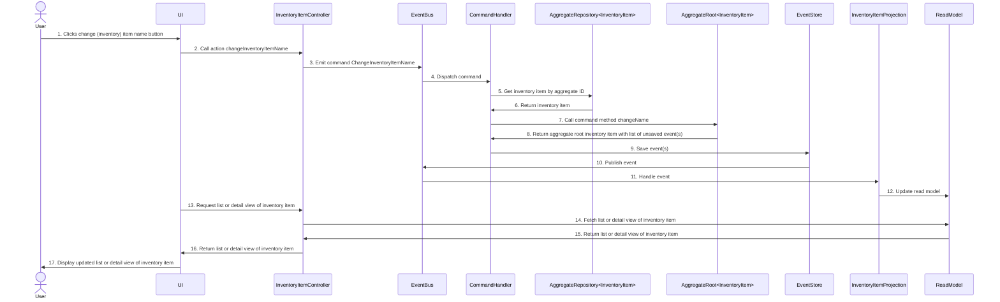

+++
draft = true
author = "Simon Schoof"
title = "The slightly more complex thingy: A CQRS/ES backend in Kotlin"
date = "2024-07-19"
description = "A CQRS/ES backend in Kotlin with Spring Boot, Spring events, and an embedded database"
tags = [
    "cqrs",
    "event-sourcing",
    "domain-driven-design", 
    "kotlin",
    "spring-boot",
    "embedded-database"
]
references = [
    { name = "simplest-possible-thing", url = "https://github.com/gregoryyoung/m-r/tree/master" },
    { name = "cqrs-task-based-uis-event-sourcing", url = "https://gist.github.com/simonschoof/74e155447fbc2ac47b0f7c0bb5a5f778" },
    { name = "kotlin-multiplatform-compose", url = "https://www.jetbrains.com/compose-multiplatform/" },
    { name = "csharp-lang", url = "https://dotnet.microsoft.com/en-us/languages/csharp" },
    { name = "dotnet", url = "https://dotnet.microsoft.com/" },
    { name = "kotlin-lang", url = "https://kotlinlang.org/" },
    { name = "spring-boot", url = "https://spring.io/projects/spring-boot" },
    { name = "spring-mvc", url = "https://docs.spring.io/spring-framework/docs/current/reference/html/web.html" },
    { name = "spring-events", url = "https://www.baeldung.com/spring-events" },
    { name = "spring-data", url = "https://spring.io/projects/spring-data" },
    { name = "ktorm", url = "https://ktorm.liuwj.me/" },
    { name = "flyway", url = "https://flywaydb.org/" },
    { name = "postgresql", url = "https://www.postgresql.org/" },
    { name = "embedded-postgresql", url = "https://github.com/zonkyio/embedded-postgres" },
    { name = "gradle", url = "https://gradle.org/" },
    { name = "jackson", url = "https://github.com/FasterXML/jackson" },
    { name = "kotest", url = "https://kotest.io/" },
    { name = "mockk", url = "https://mockk.io/" },
    { name = "kotlin-logging", url = "https://github.com/oshai/kotlin-logging" },
    { name = "kestrel", url = "https://github.com/cultureamp/kestrel" },
    { name = "event-sourcing-with-kotlin", url = "https://tuhrig.de/event-sourcing-with-kotlin/" },
    { name = "kotlin-event-sourcing-example", url = "https://github.com/nicusX/kotlin-event-sourcing-example" },
    { name = "functional-event-sourcing-example", url = "https://dev.to/jakub_zalas/functional-event-sourcing-example-in-kotlin-3245" },
    { name = "practical-guide-event-sourcing", url = "https://medium.com/ssense-tech/event-sourcing-a-practical-guide-to-actually-getting-it-done-27d23d81de04" },
    { name = "event-sourcing-netcore", url = "https://github.com/oskardudycz/EventSourcing.NetCore?tab=readme-ov-file" },
    { name = "marten", url = "https://martendb.io/" },
    { name = "marten-events", url = "https://martendb.io/events/" },
    { name = "projections-read-models", url = "https://event-driven.io/en/projections_and_read_models_in_event_driven_architecture/" },
    { name = "esversioning", url = "https://leanpub.com/esversioning/read#leanpub-auto-immutability" },
    { name = "ddd-read-models", url = "https://xebia.com/blog/domain-driven-design-part-3-read-models/" },
    { name = "exposed", url = "https://github.com/JetBrains/Exposed" },
    { name = "axon-framework", url = "https://www.axoniq.io/products/axon-framework" },
    { name = "dependency-injection", url = "https://martinfowler.com/articles/injection.html" },
    { name = "eaa-catalog", url = "https://martinfowler.com/eaaCatalog/" },
    { name = "domain-model", url = "https://martinfowler.com/eaaCatalog/domainModel.html" },
    { name = "dependency-injection", url = "https://martinfowler.com/articles/injection.html" },
    { name = "data-classes", url = "https://kotlinlang.org/docs/data-classes.html" },
    { name = "arrow-kt", url = "https://arrow-kt.io/" },
    { name = "immutable-data", url = "https://arrow-kt.io/learn/immutable-data/intro/" },
    { name = "layers-onions-ports-adapters", url = "https://blog.ploeh.dk/2013/12/03/layers-onions-ports-adapters-its-all-the-same/" },
    { name = "vertical-slice-architecture", url = "https://www.jimmybogard.com/vertical-slice-architecture/" },
    { name = "dependencies-workflow-oriented-design", url = "https://fsharpforfunandprofit.com/posts/dependencies/#workflow-oriented-design" },
    { name = "udi-dahan-if-domain-logic", url = "https://www.youtube.com/watch?v=fWU8ZK0Dmxs" }
]
+++


<!-- TODO:
* Add all links and references
* Move references to the bottom again
* Go through all parts of the text and check if everything is correct and makes sense and reads well. Rewrite accordingly.
* Proof read via Tool of choice
* Add class diagram* 
* publish post -->

In this post, we will build an application using Kotlin, Spring Boot, Spring Events and an embedded database that introduces 
a Command Query Responsibility Segregation (CQRS) and Event Sourcing (ES) architecture. 

## Introduction


We will implement a simple CQRS/ES architecture to show how a backend application can be structured using these concepts.
The application is built on top of the implementation of [<sup>[1](#ref-1)</sup>], 
but uses [<sup>[2](#ref-2)</sup>] and [<sup>[3](#ref-3)</sup>] 
instead of [<sup>[4](#ref-4)</sup>] and [<sup>[5](#ref-5)</sup>] 
and adds an [<sup>[6](#ref-6)</sup>] [<sup>[7](#ref-7)</sup>]
and [<sup>[8](#ref-8)</sup>] to the mix.
A frontend application is also part of the codebase, but is not the focus of this article.

The frontend application is created using [<sup>[9](#ref-9)</sup>] and serves more to demonstrate and facilitate interaction with the backend.
For the domain side of the application, we also follow the original SimpleCQRS project and implement a simple inventory management system with only one aggregate root, 
the *InventoryItem*. The application is structured in a way that makes it easy to extend with more aggregate roots, commands, events, and projections.
Nevertheless, the application is not production-ready and many features such as security, monitoring, proper error handling and logging, etc. are missing.
The focus of the project is to demonstrate the concepts of CQRS and ES and their implementation in Kotlin using Spring Boot.

In this post, we will give a brief introduction to the underlying concepts of Domain Driven Design (DDD), CQRS and ES.
Please note that each of the concepts is very complex in its own right and we will only scratch the surface.
In the following section, we will explain the flow and structure of the application. 
We will then present the technologies used in the project and give a brief overview of the codebase structure.
After that, we will explain the components of the codebase and how they interact with each other.
Finally, we will give a brief outlook on the next post in this series, which will focus on testing the application.

As already mentioned, the application is not yet ready for production and many functions are missing, but there are production-ready frameworks 
for CQRS/ES such as the [<sup>[10](#ref-10)</sup>] or [<sup>[11](#ref-11)</sup>].
Furthermore, you can find many more implementations of CQRS/ES online. 
Here is a short and definitely incomplete list of projects that I found while working on the project:

* [<sup>[12](#ref-12)</sup>] 
* [<sup>[13](#ref-13)</sup>]
* [<sup>[14](#ref-14)</sup>]
* [<sup>[15](#ref-15)</sup>]
* [<sup>[16](#ref-16)</sup>]
* [<sup>[17](#ref-17)</sup>]

All the examples are in Kotlin or C#, but you can probably find more examples in the language of your choice.


## Concepts

In this section, we provide a brief introduction to the fundamental concepts used in implementing the project.
We will only scratch the surface of each concept and provide a brief overview. Each concept could fill an entire book or at least a separate blog post.
Please note, therefore, that further reading on each concept is necessary and highly recommended. Also note that the explanations are simplified and probably not strictly defined enough.

##### Domain Driven Design (DDD)

I first heard about CQRS and event sourcing in the context of Domain-Driven Design (DDD).
DDD is an approach to developing software that focuses on the domain and business logic of the application. 
It was introduced by Eric Evans in his seminal book Domain-Driven Design: Tackling Complexity in the Heart of Software [<sup>[18](#ref-18)</sup>] in 2003.
Since the publication of the book, DDD has grown in popularity and is now a widely used approach in software development, 
where many other resources such as books, e.g. "Implementing Domain-Driven Design" by Vaughn Vernon[<sup>[19](#ref-19)</sup>],
"Domain-Driven Design Principles, Patterns, and Practices" by Scott Millet and Nick Tune[<sup>[20](#ref-20)</sup>] 
or Domain Modeling Made Functional by Scott Wlaschin<sup>[21](#ref-21)</sup>, as well as a variety of blog posts and videos are available.
Eric Evans's book itself is divided into two parts.
The first part is about designing and implementing the domain model using tactical patterns such as Aggregates, Repositories, Factories, and Domain Events. 
The second part is about the strategic patterns such as Bounded Contexts, Context Maps, and Shared Kernel.
While the second part is considered by many people and Eric Evans himself to be the more important one,
we will concentrate on some of the tactical patterns, since we are implementing an example in this project.
In the following, we will go through the small list of tactical patterns used in the project.


**Aggregates and Aggregate Roots**

We start with aggregates and the aggregate root, which is also the main abstraction in implementing the project.
An aggregate is a cluster of domain objects (entities and value objects) that can be treated as a single unit.
The aggregate root is the main entity of the aggregate and the only entity that can be accessed from outside the aggregate. 
The aggregate root is responsible for maintaining the consistency of the aggregate. In our project, we have only one aggregate, the
*InventoryItem*, which is also the aggregate root.

**Factories**

A factory in DDD is responsible for creating an aggregate in a consistent state. The factory of DDD is not the same as one of the Gang of Four's factory patterns[<sup>[50](#ref-50)</sup>], 
but the factory patterns could be used to implement a factory in DDD. The point of a factory in DDD is to create an aggregate in a consistent state.
In the project, we simply have the constructor of the *InventoryItem* and an invoke-function on a companion object as a factory.

**Repositories** 

A repository in DDD is responsible for loading and saving aggregates. It is also an abstraction that hides the details of the underlying data store from the domain 
when working with an architecture that adheres to the Dependency Inversion Principle (DIP).
Again, it is important to note that when loading and saving an aggregate, the entire aggregate is loaded and saved in a consistent state. 
In this project, we have the *AggregateRepository*, which has a dependency on the *EventStore* and is responsible for loading and saving the events of the *InventoryItem* aggregate.
Since we are using event sourcing, the repository is not responsible for loading and saving the aggregate state, but rather for the events that lead to the current aggregate state.

**Domain Events**

A core concept in the implementation of our project is domain events. Domain events are events that are published when there has been a change in the aggregate, i.e. a change in the state of the application.
The event names are given in the past tense and describe what has happened in the aggregate. The events are stored in the event store and are used to rebuild the state of the aggregate, hence the name event sourcing. 
The events are also used to update the read side of the application via projections. We use Marten's definition of projections as

> any strategy for generating "read side" views from the raw events.

Domain events are not used to integrate with other systems or services, so-called integration events are used.


##### Dependency Inversion Principle (DIP) compliant architecture

To isolate the domain from the infrastructure and make the domain independent of the infrastructure, 
we use the Dependency Inversion Principle (DIP) [<sup>[22](#ref-22)</sup>]. 
This is the basic principle of many architectures such as the {< linkForRef "layers-onions-ports-adapters" "Hexagonal Architecture, Onion Architecture or Clean Architecture">}[<sup>[23](#ref-23)</sup>]
The DIP states that
> high-level modules should not depend on low-level modules. Both should depend on abstractions. 

We will see how this is implemented in the project later in this post. 
While isolating the domain from the infrastructure is a good practice, it is still controversial. See [<sup>[24](#ref-24)</sup>], [<sup> [25](#ref-25)</sup>] or [<sup>[26](#ref-26)</sup>], since isolation comes with higher complexity costs in architecture and code. 
The decision for an implementation with a [<sup>[27](#ref-27)</sup>] also depends on the complexity of the area and the business logic. Other [<sup>[28](#ref-28)</sup>] such as transaction script or table module might be more suitable for simple domains. Nevertheless, we are using a DIP-compliant architecture for this project.

##### Dependency Injection (DI)

In the previous segment, we discussed the DIP-compliant architecture and how high- and low-level modules should depend on abstractions.
We will use [<sup>[29](#ref-29)</sup>] to fulfill this principle and decouple the domain from the infrastructure.
Dependency injection[<sup> [30](#ref-30)</sup>] is a technique in which an object provides the dependencies of another object instead of that object creating the dependencies itself. 
This is done by injecting the dependencies into the object that needs them. 
This can be done through constructor injection, setter injection or interface injection, but we only use constructor injection in the project. 
This will also help us when testing the application, where we can test the domain logic in isolation and provide mock implementations for the infrastructure dependencies. 
We will talk more about testing in the next post of this blog.

##### Command Query Responsibility Segregation (CQRS)

CQRS is one of the two main architectural patterns we want to demonstrate in implementing the project. CQRS is an extension of the command-query separation principle (CQS), which was introduced by Bertrand Meyer in his book "Object-Oriented Software Construction" [<sup> [31](#ref-31) </sup>]. 
CQS states that a method should either change the state of an object or return a result, but not both. CQRS takes this principle further and separates the reading and writing operations of an application into two different parts of the application.

In its simplest form, CQRS

> is simply the creation of two objects where there was previously only one.

While one object is responsible for processing the commands and changing the state of the application, the so-called write side of the application.
The other object is responsible for processing the queries and returning the state of the application, the so-called read side of the application. 
To start with, CQRS is no more than that, as Greg Young describes in his blog post [<sup>[32](#ref-32)</sup>]. 
Nevertheless, CQRS allows us to optimize an application's reads and writes independently of each other and to introduce other interesting patterns such as event sourcing, task-based UIs, and eventual consistency,
even though these are not part of CQRS itself.

##### Event Sourcing (ES)

The next pattern we will take a closer look at for implementing the project is event sourcing. 
Event sourcing is a pattern where the state of an application is determined by a sequence of events, rather than by directly storing the current state of the object. 
The events are an excellent way to capture the changes in the state of the domain and also provide an audit log of the changes. 
Event sourcing is a very different approach than the traditional method of persisting the state of the application and comes with its own set of challenges, such as versioning or snapshots. 
Solutions to these challenges can be found in the (unfinished) book "Versioning in an Event Sourced System"[<sup>[33](#ref-33)</sup>] by Greg Young.

## Technologies used

In addition to the concepts described above and before we go into the details of the project implementation,
I would like to briefly list the most important technologies of the project:

* [<sup>[2](#ref-2)</sup>]
* [<sup>[34](#ref-34)</sup>]
* [<sup>[3](#ref-3)</sup>] with [<sup>[35](#ref-35)</sup>], [<sup>[8](#ref-8)</sup>], and parts of [<sup>[36](#ref-36)</sup>]
* [<sup>[37](#ref-37)</sup>]
* [<sup>[38](#ref-38)</sup>]
* [<sup>[7](#ref-7)</sup>]
* [<sup>[6](#ref-6)</sup>]
* [<sup>[39](#ref-39)</sup>]
* [<sup>[40](#ref-40)</sup>]
* [<sup>[41](#ref-41)</sup>]
* [<sup>[42](#ref-42)</sup>]
* [<sup>[9](#ref-9)</sup>]  

## Package structure and application flow

#### Package structure

As mentioned in the section above about the architecture that follows the Dependency Inversion Principle (DIP), we use DIP to isolate the domain from the infrastructure.
We use packages to structure the application so that the domain is separate from the infrastructure.
This means that there are no dependencies from other packages to the domain package.
The domain is the core of the application and contains the building blocks as abstractions. The building blocks are: 

* *AggregateRoot*
* *AggregateRepository*
* *EventBus*
* *EventStore*
* *Command*
* *Event*

In addition to the building blocks, we have the domain logic in the InventoryItem class and the events and commands in the domain package.
The infrastructure package contains the implementations of the building blocks for persistence, the event store and the event bus.
The infrastructure package also contains the *InventoryItemController*, which is responsible for processing the API calls from the front-end application.
The application package contains the *CommandHandler* class.
The read models and the projections are located in the readmodel package.

```
cqrs-es
├── application
├── config
├── domain
│   ├── buildingblocks
├── infrastructure
│   ├── persistence
│   ├── web
└── readmodels
```

 

#### Application flow

As we saw in the previous section, there are many concepts and patterns that we use to structure the application.
Before we get into the implementation details, let's provide a high-level overview of the overall flow and structure of the application.
The application allows the user to manage inventory items, where the user can

* Create inventory items
* Change the name of an inventory item
* Check in inventory items
* Remove inventory items
* Set and change the maximum quantity for the inventory item
* Deactivate an inventory item

The user can also query the read side of the application for a list and a detail view of the inventory items.
This corresponds to the original SimpleCQRS project. For examples with more complex domains, see the list in the introduction.
To provide an overview of the operations in the application, we will walk through the flow of the application. 
Starting with the user submitting a command to the application. The command is processed by a command handler, which is responsible for processing the command and changing the state of the application. The command handler uses the an aggregate repository to load the aggregate, which in our case is the *InventoryItem*, and to store the events that lead to the current state of the aggregate. The events are stored in the event store. 
The comand handler then publishes the events on the event bus. The event bus is responsible for publishing the events to the event listeners.
The event listeners are responsible for updating the application's read model.
The read model is the read side of the application and is used to query the current state of the application. 
The read model is updated via projections. The projections are responsible for updating the read model with the events published by the event bus.
The read model is then used to query the current state of the application.
The following sequence diagram shows the application flow for changing the name of an inventory item:



As we saw in the sequence diagram above, several components are involved in triggering and processing a command, updating the domain object's state
and finally updating the read model. We will now go through the code of the components, following the flow of the sequence diagram.
We will start directly with the call to the *InventoryItemController*.
We will follow the steps of the sequence diagram and explain the code of the components involved. 
We will further divide the code walkthrough into the write side of the application and the read side of the application, even though we use inline projections to update the read model. Therefore, we will not address eventual consistency due to asynchronous projections.
I would like to reiterate that eventual consistency is not part of CQRS itself, but can be used in combination with CQRS.

##### Write Side of the application

If we start with the *InventoryItemController*, we see that it has a POST endpoint for the *changeInventoryItemName* action.
For this action, we expect a request body with the aggregate ID and the new name of the inventory item as a JSON object.
From this request body, we construct the *ChangeInventoryItemName* command and send it to the *EventBus* using the *send* function.
The *EventBus* is injected into the *InventoryItemController* via the constructor.

```kotlin
private val logger = KotlinLogging.logger {}

@RestController
//@CrossOrigin(origins = ["http://localhost:8081"])
class InventoryItemController(
    private val eventBus: EventBus,
    private val readModelFacade: ReadModelFacade
) {
    data class ChangeInventoryItemNameRequest(
        val aggregateId: String,
        val newInventoryItemName: String
    )

    @PostMapping(
        value = ["/api/changeInventoryItemName"],
        consumes = [MediaType.APPLICATION_JSON_VALUE],
        produces = [MediaType.APPLICATION_JSON_VALUE]
    )
    fun changeInventoryItemName(@RequestBody changeInventoryItemNameRequest: ChangeInventoryItemNameRequest) {
        val changeInventoryItemName = ChangeInventoryItemName(
            UUID.fromString(changeInventoryItemNameRequest.aggregateId),
            changeInventoryItemNameRequest.newInventoryItemName
        )
        eventBus.send(changeInventoryItemName)
    }

    // other endpoints
}
```

The *EventBus* interface is defined in the domain package and has two functions, one for publishing an event and one for sending a command.

```kotlin
interface EventBus {
    fun publish(event: Event)
    fun send(command: Command)
}
```

The implementation of the *EventBus* is included in the infrastructure package and uses Spring Events to send commands and publish events. 

```kotlin
@Component
class SpringEventBus(val publisher: ApplicationEventPublisher): EventBus {

    override fun publish(event: Event) {
        publisher.publishEvent(event)
    }

    override fun send(command: Command) {
        publisher.publishEvent(command)
    }

}
```

The command is then dispatched to the *InventoryItemCommandHandlers* class<cite>[^1]<cite>.
In the *InventoryItemCommandHandlers* class, the command is processed and the state of the application is changed if the command is valid and the
state of the aggregate is consistent. Otherwise, the command is rejected. Processing a command generally follows this pattern:

1. Load the aggregate from the database through the aggregate repository
2. Call the domain method on the aggregate root
3. Store the events in the event store
4. Publish the events to the event bus

We find the described pattern in the *InventoryItemCommandHandlers* class in the handle method for the *ChangeInventoryItemName* command, as shown in the following code snippet.

```kotlin 
@Component
@Transactional
class InventoryItemCommandHandlers(private val aggregateRepository: AggregateRepository<InventoryItem>) {

    @EventListener
    fun handle(command: ChangeInventoryItemName) {
        aggregateRepository.getById(command.aggregateId)        // (1) load aggregate from the database with event sourcing
            .ifPresent {                                        //     if the aggregate is found
                it.changeName(command.newName)                  // (2) try to execute the command on the aggregate 
                    .hasChanges()                               //     check if the command resulted in changes
                        .apply { aggregateRepository.save(it) } // (3) if changes, save the aggregate and publish the events
            }
    }

    // other command handlers
}
```

**(1) Load the aggregate from the database via the aggregate repository**

The first step in handling a command is to load the aggregate from the database using the aggregate repository, unless you are creating a new aggregate.
To be able to locate the aggregate, the command must include the aggregate ID. In our case, the aggregate ID is just a UUID.
Since we are using event sourcing, the aggregate's current state is determined by all events that have been recorded as changes to the aggregate state.
If we look at the *AggregateRepository* interface, we can see that the *getById* function returns an *Optional* of the *AggregateRoot*.

```kotlin
interface AggregateRepository<T: AggregateRoot<T>> {

    fun getById(id: AggregateId): Optional<T>

    // other functions
}
```

The implementation of the *getById* function is located in the *EventStoreAggregateRepository* class and
loads the aggregate from the database. It does this by:

1. Fetching all events for the aggregate from the event store
2. Creating an empty instance of the aggregate
3. Applying all events to the aggregate using the *loadFromHistory* function
4. Returning an optional of the aggregate or an empty optional if no events were found for the aggregate


```kotlin
@Component
class EventStoreAggregateRepository<T : AggregateRoot<T>>(
    private val eventStore: EventStore,
    private val aggregateQualifiedNameProvider: AggregateQualifiedNameProvider
) : AggregateRepository<T> {

    @Suppress("UNCHECKED_CAST")
    override fun getById(id: AggregateId): Optional<T> {

        val events = eventStore.getEventsForAggregate(id)

        events.ifEmpty { return Optional.empty()}

        val emptyAggregate =
            Class.forName(aggregateQualifiedNameProvider.getQualifiedNameBySimpleName(events.first().aggregateType))
                .kotlin.java.getDeclaredConstructor().newInstance() as T

        val aggregate = emptyAggregate.loadFromHistory(events)

        return Optional.of(aggregate)
    }

    // other functions

}
```

As we can see from the constructor in the *EventStoreAggregateRepository* class, the *EventStoreAggregateRepository* has two collaborators as dependencies:
the *EventStore* and the *AggregateQualifiedNameProvider*. We will take a closer look at the qualified name providers later in the section [Conventions and Workarounds](#conventions-and-workarounds).
The implementation of the *EventStore* can be found in the *KtormEventStore* class. 
As the name of the class suggests, *KtormEventStore* uses Ktorm<cite>[^2]<cite> as the ORM for interacting with the database.
We won't go into detail about Ktorm here, but we can see that it provides us with a type-safe query DSL for interacting with the database. 
To get the events for an aggregate, we have to query the event table in the database, filter the events by the aggregate ID, and order the events by the timestamp.
The events are then assigned to the corresponding event class and returned as a list of events.
We also find an *EventQualifiedNameProvider* in the *KtormEventStore* class, which we will discuss later in the [Conventions and Workarounds](#conventions-and-workarounds) section. 

```kotlin
@Component
class KtormEventStore(
    private val database: Database,
    private val e: EventTable = EventTable.aliased("e"),
    private val clock: Clock,
    private val objectMapper: ObjectMapper,
    private val eventBus: EventBus,
    private val eventQualifiedNameProvider: EventQualifiedNameProvider
) : EventStore {

    override fun getEventsForAggregate(aggregateId: AggregateId): List<Event> =
        database.from(e)
            .select()
            .where { e.aggregateId eq aggregateId }
            .orderBy(e.timestamp.asc())
            .map {
                val eventTypeClass =
                    Class.forName(eventQualifiedNameProvider.getQualifiedNameBySimpleName(it[e.eventType]!!))
                        .kotlin
                        .javaObjectType

                objectMapper.convertValue(it[e.data]!! as LinkedHashMap<*, *> , eventTypeClass) as Event
            }

    // other functions
}
```

That's almost all we need to load the aggregate from the database using event sourcing. There's just one piece missing, we haven't discussed the 
*loadFromHistory* function in the *AggregateRoot* interface. We will look at this function in more detail in the next step, when we call the 
domain function of the loaded aggregate. We will then see that we need to distinguish between new and existing events when applying the events to the aggregate.

**(2) Call the domain function of the loaded aggregate**

The next step is to try to execute the command on the aggregate and change its state. To do that, we need to
look at the *AggregateRoot* interface and the *InventoryItem* class, which is our only aggregate in the project. The following code snippet shows the
*InventoryItem* class and the *AggregateRoot* interface:

```kotlin
interface AggregateRoot<T> where T : AggregateRoot<T> {

    // properties

    fun applyChange(event: Event, isNew: Boolean = true): T =
        applyEvent(event).apply { if (isNew) changes += event }

    fun applyEvent(event: Event): T

    fun hasChanges() = changes.isNotEmpty()

    @Suppress("UNCHECKED_CAST")
    fun loadFromHistory(history: List<Event>): T =
        history.fold(this as T) { acc: T, event: Event ->
            acc.applyChange(event, false)
    }

    // more functions
}

data class InventoryItem(/* constructor parameters */) : AggregateRoot<InventoryItem> {

    override fun applyEvent(event: Event): InventoryItem = when (event) {
        is InventoryItemNameChanged -> copy(name = Optional.of(event.newName))
        // other events
        else -> this
    }

    fun changeName(newName: String): InventoryItem = applyChange(
        InventoryItemNameChanged(
            this.baseEventInfo(),
            newName = newName
        )
    )

    // other methods
}
```

As we saw in the command handler, we call the *changeName* function in the *InventoryItem* class.
In the *changeName* function, we create a new *InventoryItemNameChanged* event and call the *applyChange* function in the *AggregateRoot* interface.
The *applyChange* function then calls the *applyEvent* function in the InventoryItem class and adds the event to the aggregate's change list. This is
due to the isNew boolean flag, which defaults to true. The *applyEvent* function takes an event and uses pattern matching to
match the event against the appropriate event class and update the state of the aggregate accordingly. The updated aggregate is then
returned according to the aggregate immutability pattern.
As mentioned earlier, we need to distinguish between new and existing events when applying the events to the aggregate. As we see in the 
*AggregateRoot* interface, we use the *applyChange* function with the *isNew* flag set to false.
This is because when we load the aggregate from history and apply its events, we don't want to add the existing events to the aggregate's change list.
The change list is used only to keep track of the new events added to the aggregate. In the next step, we'll look at how the events are
stored in the event store and then published.

**(3) Save the events to the event store and publish the events to the event bus**

The next step is to store the events in the event store and publish the events on the event bus.
To store and publish the events, we need to look at the *AggregateRepository* and the event store again.
Similar to the *getById* function, there is a *save* function in the *AggregateRepository* interface that takes an aggregate as a parameter.

```kotlin
interface AggregateRepository<T: AggregateRoot<T>> {
    fun save(aggregate: T)
    fun getById(id: AggregateId): Optional<T>
}
```

We can find the *EventStoreAggregateRepository* class again.

```kotlin
@Component
class EventStoreAggregateRepository<T : AggregateRoot<T>>(
    private val eventStore: EventStore,
    private val aggregateQualifiedNameProvider: AggregateQualifiedNameProvider
) : AggregateRepository<T> {

    override fun save(aggregate: T) {
        aggregate.id.ifPresent {
            eventStore.saveEvents(
                aggregateId = it,
                aggregateType = aggregate.aggregateType(),
                events = aggregate.changes
            )
        }
    }
```

When we store the events, we use the injected *EventStore* collaborator for this purpose as well.
The implementation of the *saveEvents* function in the *KtormEventStore* class is shown in the following code snippet:

```kotlin
@Component
class KtormEventStore(
    private val database: Database,
    private val e: EventTable = EventTable.aliased("e"),
    private val clock: Clock,
    private val objectMapper: ObjectMapper,
    private val eventBus: EventBus,
    private val eventQualifiedNameProvider: EventQualifiedNameProvider
) : EventStore {

    override fun saveEvents(aggregateId: AggregateId, aggregateType: String, events: List<Event>) {
        events.forEach { event: Event ->
            saveEvent(aggregateId, aggregateType, event)
            eventBus.publish(event)
        }
    }

    private fun saveEvent(aggregateId: AggregateId, aggregateType: String, event: Event) {
        database.insert(e) {
            set(e.eventType, event::class.simpleName)
            set(e.aggregateId, aggregateId)
            set(e.aggregateType, aggregateType)
            set(e.timestamp, event.timestamp)
            set(e.data, event)
        }
    }
}
```

As we can see in the code above, the *saveEvents* function stores the events in the database using Ktorms insert function
and then publishes the events on the event bus. This completes the write side of the application and
we can proceed to the read side.

##### Read Side of the application

With the publication of the events on the event bus, we have completed the write side of the application and changed the application state.
We now want this to be reflected on the read side of the application, update the read model and show the changes to the user when they query a read model. To do this, we use [<sup>[43](#ref-43)</sup>] which means that we monitor the in-memory event bus and update the read model directly when an event is published.<cite>[^3]</cite> 
So let's take a look at the *InventoryItemProjection* file, which does just that. In the file, we find two classes,
one containing the event listeners for a list view of inventory items and the other containing the event listeners for a detail view of inventory items. Again, we'll only show the listeners for the *InventoryItemNameChanged* event, since we've chosen this for our example.  

```kotlin
@Component
@Transactional
class InventoryItemListView(
    private val database: Database,
    private val rmiit: ReadModelInventoryItemTable = ReadModelInventoryItemTable.aliased("rmiit")
) {

    val Database.inventoryItems get() = this.sequenceOf(rmiit)

    @EventListener
    fun handle(event: InventoryItemNameChanged) {
        logger.info { "changed name of inventory item to name ${event.newName}" }
        database.inventoryItems.find { it.aggregateId eq event.aggregateId }?.let {
            it.name = event.newName
            it.flushChanges()
        } ?: throw IllegalStateException("Inventory item with id ${event.aggregateId} not found")
    }

    // other event listeners for the InventoryItemListView
}

@Component
@Transactional
class InventoryItemDetailView(
    private val database: Database,
    private val rmiidt: ReadModelInventoryItemDetailsTable = ReadModelInventoryItemDetailsTable.aliased("rmiidt")
) {

    val Database.inventoryItemDetails get() = this.sequenceOf(rmiidt)

    @EventListener
    fun handle(event: InventoryItemNameChanged) {
        logger.info { "changed name of inventory item to name ${event.newName}" }
        database.inventoryItemDetails.find { it.aggregateId eq event.aggregateId }?.let {
            it.name = event.newName
            it.flushChanges()
        } ?: throw IllegalStateException("Inventory item with id ${event.aggregateId} not found")
    }

    // other event listeners for the InventoryItemDetailView
}
```

The list and detail view models are implemented as relational tables in the database. In the code snippet above, we see
that we have the same workflow with different tables for both views. First, we locate the inventory item in the database by its aggregate ID,
then update the name of the inventory item and commit the changes to the database. Again, we use Ktorm to interact with the database. 
Here we take full advantage of Ktorm's ORM capabilities and use its entity feature to map the tables to Kotlin classes. Again, we won't go into the details of Ktorm here either, but you should be able to see that the code is easy to read and understand what is happening.
With the read model updated, we can query the read model via the *InventoryItemController* and return the inventory item list or details view to the user.
The last thing to be shown is that we have implemented a *ReadModelFacade* to have a central point for querying the read model.
The *ReadModelFacade* is injected into the *InventoryItemController* and is used to query the read model.

```kotlin
interface ReadModelFacade {
    fun getInventoryItems(): List<InventoryItemDto>
    fun getInventoryItemDetails(aggregateId: AggregateId): Optional<InventoryItemDetailsDto>
}

@Component
class KtormReadModelFacade(
    private val database: Database,
    private val rmiit: ReadModelInventoryItemTable = ReadModelInventoryItemTable.aliased("rmiit"),
    private val rmiidt: ReadModelInventoryItemDetailsTable = ReadModelInventoryItemDetailsTable.aliased("rmiidt")
) : ReadModelFacade {

    override fun getInventoryItems(): List<InventoryItemDto> {
        return database.from(rmiit)
            .select()
            .map {
                InventoryItemDto(
                    aggregateId = it[rmiit.aggregateId]!!,
                    name = it[rmiit.name]!!
                )
            }
    }

    // implementation of getInventoryItemDetails

}

@RestController
//@CrossOrigin(origins = ["http://localhost:8081"])
class InventoryItemController(
    private val eventBus: EventBus,
    private val readModelFacade: ReadModelFacade
) {

    // other endpoints

    @GetMapping(
        value = ["/api/inventoryItems"],
        produces = [MediaType.APPLICATION_JSON_VALUE]
    )
    fun getInventoryItems() : List<InventoryItemDto> {
        return readModelFacade.getInventoryItems()
    }

    @GetMapping(
        value = ["/api/inventoryItemDetails/{aggregateId}"],
        produces = [MediaType.APPLICATION_JSON_VALUE]
    )
    fun getInventoryItemDetails(@PathVariable aggregateId: String): Optional<InventoryItemDetailsDto> {
        return readModelFacade.getInventoryItemDetails(UUID.fromString(aggregateId))
    }
}
```

With that, we have finished the read side of the application. The updated read models can be queried and displayed to the user.
The example domain  is quite simple, but can be extended to more complex views combining multiple aggregates.
The read models also don't necessarily have to be relational tables in the database, but can be implemented in different ways. 
Also, we only used inline projections instead of asynchronous projections to update the read models, which would result in a consistent system.
In the next section, we will look at some conventions and workarounds in the code that were chosen as solutions to some problems
that arose during the implementation of the project.

##### Conventions and workarounds in the code

While going through the code, we saw some implementation details that are a bit different from the original SimpleCQRS project and also
from a solution that would have been written in Java, because we are using some concepts of Kotlin for the implementation. I'm not sure if these solutions are good or if they will even lead to more problems in the future.

**Creation of an Aggregate and Immutability**

First, we'll cover how to create an aggregate and the decision to
make the aggregate immutable. As mentioned earlier, we have the *AggregateRoot* interface and the *InventoryItem* class as its implementation.

```kotlin
interface AggregateRoot<T> where T : AggregateRoot<T> {

    val id: Optional<AggregateId>
    val changes: MutableList<Event>
    val clock: Clock

    fun applyChange(event: Event, isNew: Boolean = true): T =
        applyEvent(event).apply { if (isNew) changes += event }

    fun applyEvent(event: Event): T

    // other functions
}

data class InventoryItem(
    override val id: Optional<AggregateId> = Optional.empty(),
    override val changes: MutableList<Event> = mutableListOf(),
    override val clock: Clock = Clock.systemUTC(),
    private val name: Optional<String> = Optional.empty(),
    private val isActivated: Boolean = false,
    private val availableQuantity: Int = 0,
    private val maxQuantity: Int = Int.MAX_VALUE,
) : AggregateRoot<InventoryItem> {

    override fun applyEvent(event: Event): InventoryItem = when (event) {
        is InventoryItemCreated -> copy(
            id = Optional.of(event.aggregateId),
            name = Optional.of(event.name),
            availableQuantity = event.availableQuantity,
            maxQuantity = event.maxQuantity,
            isActivated = true
        )
        is InventoryItemNameChanged -> copy(name = Optional.of(event.newName))
        is InventoryItemsRemoved -> copy(availableQuantity = event.newAvailableQuantity)
        is InventoryItemsCheckedIn -> copy(availableQuantity = event.newAvailableQuantity)
        is InventoryItemDeactivated -> copy(isActivated = false)
        else -> this
    }

    companion object {
        operator fun invoke(
            inventoryItemName: String,
            availableQuantity: Int,
            maxQuantity: Int,
            clock: Clock = Clock.systemUTC()): InventoryItem {
            val inventoryItem = InventoryItem(clock = clock)
            val event = InventoryItemCreated(
                inventoryItem.baseEventInfo(isNew = true),
                name = inventoryItemName,
                availableQuantity = availableQuantity,
                maxQuantity = maxQuantity
            )
            return inventoryItem.applyChange(event)
        }
    }

    fun changeName(newName: String): InventoryItem = applyChange(
        InventoryItemNameChanged(
            this.baseEventInfo(),
            newName = newName
        )
    )

    // other functions
}
```

In the AggregateRoot interface, we have defined three properties: the *ID*, the *change* list, and a *clock*, which must be overridden in the constructor of the aggregate implementation. Additional properties can then be defined in the aggregate itself. I chose to make the aggregate immutable by defining all properties with the val keyword and using [<sup>[44](#ref-44)</sup>].
The aggregate's additional properties are then defined in the data class's constructor and must have a default value. This way, we can instantiate an empty aggregate with the default values via the constructor.
As we have seen, we need an empty instance of the aggregate to apply the events to the aggregate when it is loaded from the database. When we want to create a new aggregate, we have to provide and use an *invoke* function in a companion object of the aggregate.
The *invoke* function is then used to create a new instance of the aggregate and apply an initial creation event to the aggregate. With the constructor with default properties and the *invoke* function, we can distinguish between creating a new aggregate and creating an empty instance of the aggregate to use event sourcing to restore the current state of the aggregate.
Another thing we saw is that the aggregate is immutable and we return a copy of the aggregate with the new state when we call the *applyEvent* function of the aggregate. Immutability is a common pattern in functional programming and is also recommended for domain modeling in DDD by [<sup>[45](#ref-45)</sup>] and seems to be gaining popularity in the DDD community as well.
While I didn't use the Arrow-kt library in the project, you can find more information about immutability and domain modeling in the [<sup>[46](#ref-46)</sup>] of the arrow.kt documentation and in Scott Wlaschin's book "Domain Modeling Made Functional"[<sup>[21](#ref-21)</sup>].
To summarize, we need to follow these conventions to create an aggregate and make it immutable:

* Overwrite the *ID*, *changes*, and *clock* properties in the data class constructor
* Define the aggregate's properties in the data class constructor with the val keyword and default values
* Define an *invoke* function in a companion object of the data class to create a new instance of the aggregate and apply an initial creation event to the aggregate
* Define the *applyEvent* function in the data class to apply the events to the aggregate and return a copy of the aggregate with the new state

**Loading events from the EventStore and creating the events and an empty aggregate via reflection**

Above, we saw that we need to distinguish between creating a new aggregate and loading the aggregate from the database.
To get the current state of the aggregate, we need to create an empty instance of the aggregate, load all events for the aggregate from the database, and apply all events to the aggregate. The problem here is that we don't know the type of the aggregate at runtime, even though the type is a generic type parameter of the *AggregateRoot* interface. This is due to type erasure in Java and Kotlin.
To address this problem, I store the aggregate type, which is the short name of the class, in the events table for each event.
Additionally, I also use the short name of the event classes to define the type of event in the event table. 
Now, when I load the events for an aggregate from the database, I use the event type to create an instance of the event using reflection. I had to add an additional cast to the event class here because the return type of the *objectMapper.convertValue* function is *Any* and I want to return a list of events. From the list of events, we can get the aggregate type and also create an empty instance of the aggregate using reflection. 
We can then apply all events to the aggregate and return the aggregate.


```kotlin
override fun getEventsForAggregate(aggregateId: AggregateId): List<Event> =
    database.from(e)
        .select()
        .where { e.aggregateId eq aggregateId }
        .orderBy(e.timestamp.asc())
        .map {
            val eventTypeClass =
                Class.forName(eventQualifiedNameProvider.getQualifiedNameBySimpleName(it[e.eventType]!!))
                    .kotlin
                    .javaObjectType

            objectMapper.convertValue(it[e.data]!! as LinkedHashMap<*, *> , eventTypeClass) as Event
        }
```

```kotlin
@Suppress("UNCHECKED_CAST")
override fun getById(id: AggregateId): Optional<T> {

    val events = eventStore.getEventsForAggregate(id)

    events.ifEmpty { return Optional.empty()}

    val emptyAggregate =
        Class.forName(aggregateQualifiedNameProvider.getQualifiedNameBySimpleName(events.first().aggregateType))
            .kotlin.java.getDeclaredConstructor().newInstance() as T

    val aggregate = emptyAggregate.loadFromHistory(events)

    return Optional.of(aggregate)
}
```

Looking at the code snippets above, we see that the simple name is not sufficient to create an instance of a class via reflection.
Therefore, we need the fully qualified name of the class, which consists of the package name and the simple name of the class. For reasons of refactoring, I didn't want to store the package name for the event and aggregate types in the event table. As a workaround, I created a domain class configuration with two beans, the *AggregateQualifiedNameProvider* and the *EventQualifiedNameProvider*. The *AggregateQualifiedNameProvider* is used to get the fully qualified name of all classes implementing the *AggregateRoot* interface and the *EventQualifiedNameProvider* is used to get the fully qualified name of all classes implementing the *Event* interface.
The fully qualified name can then be obtained from the simple name of the class.

```kotlin
@Configuration
class DomainClassNamesConfig() {
    @Bean("AggregateRootClassNames")
    fun aggregateRootClassNames(): Set<String> {
        val provider = ClassPathScanningCandidateComponentProvider(false);
        provider.addIncludeFilter(AssignableTypeFilter(AggregateRoot::class.java));
        val beans = provider.findCandidateComponents(BASE_PACKAGE)
        val beansNamesList = beans.mapNotNull { it.beanClassName }
        val beansNamesSet = beansNamesList.toSet()
        if (beansNamesList.count() != beansNamesSet.count()) {
            throw Error("Domain contains aggregates with the same name!")
        }
        return beansNamesSet

    }

    @Bean("EventClassNames")
    fun eventClassNames(): Set<String> {
        val provider = ClassPathScanningCandidateComponentProvider(false);
        provider.addIncludeFilter(AssignableTypeFilter(Event::class.java));
        val beans = provider.findCandidateComponents(BASE_PACKAGE)
        val beansNamesList = beans.mapNotNull { it.beanClassName }
        val beansNamesSet = beansNamesList.toSet()
        if (beansNamesList.count() != beansNamesSet.count()) {
            throw Error("Domain contains events with the same name! Follow the convention and " +
                    "prefix the event with the aggregate name")
        }
        return beansNamesSet
    }
}
```
This design leads to two further conventions that must be adhered to when working with the code:

* The name of an aggregate must be unique
* The name of an event must be unique, but should begin with the name of the aggregate to avoid conflicts

If these conventions are not followed, the application will not start and an error message will be displayed.


## How to run the application

#### Prerequisites

To run the application locally from the command line or from the IDE(I am using IntelliJ for Kotlin development) you need to have the following software installed on your machine:

For the backend:

* Java 21 or higher 

For the frontend:

* Android Studio
* Kotlin Multiplatform Compose plugin

Alternatively you can run the application with Docker. 

#### Running the application

The application is divided into two parts, the backend and the user interface. The backend is located in the `cqrs-es` directory and the user interface in the `cqrs-es-ui` directory. The commands given below must be executed in the corresponding directory.

The tests for the backend can be started with:

```shell
./gradlew test
```

You can then start the backend with:

```shell
./gradlew bootRun
```

The user interface can be started with:

```shell
./gradlew desktopRun -DmainClass=MainKt --quiet
```

for the desktop application or with

```shell
./gradlew wasmJsBrowserRun -t --quiet
```

for the web application.

It is also possible to run the entire application using Docker and Docker Compose. The docker-compose file is located in the root directory of the project, and the Dockerfiles for the backend and the user interface are located in the corresponding directories. To run the application using Docker and Docker Compose, you can use the following command:

```shell
docker compose up -d
```

This starts the backend, the user interface and the database in separate containers in the background. You can then access the user interface at `http://localhost:8081` and the backend at `http://localhost:8080`. The database is available at `localhost:5432`.

The frontend Dockerfile starts the frontend with `gradle wasmJsBrowserRun -t --quiet`, which appears to start a development server. The startup process takes a few minutes. You can see when the frontend is ready when you see the following message in the Docker container logs:

```
Waiting for changes to input files...
```

## Summary, out of scope and outlook

To wrap things up, I'd like to summarize the post, give a brief overview of the scope and take a look at the next steps.
We started by introducing the fundamental concepts used in the codebase. These included CQRS and event sourcing, but also domain-driven design, dependency injection and an architecture that follows the principle of dependency inversion.
After that, we looked at the package structure and the schematic flow of the application. The next step was to go through the code and explain the write and read side of the application. This was followed by a closer look at the conventions and workarounds used in the code.
Finally, we showed how the application can be run locally and with Docker.
Since this project is only intended as an example of how to present CQRS and event sourcing in Kotlin, there are of course many things that are not included in the project but should be considered when creating a real application.
These include the obvious areas of error handling, security, logging, and monitoring. In addition, I have removed the versioning of events and aggregates  that can be found in the original SimpleCQRS project. I'll have to take a closer look at this later and add it to the project. Another point is that the endpoints are not fully restful. With a fully restful API, the frontend could only display the actions that are available to the user. I would also like to mention that the project does not have to be a web application, nor does it have to be restful. This also works for desktop applications, classic web applications, or web applications with GraphQL.
In general, I think the project can be used as a starting point to get familiar with CQRS and event sourcing in Kotlin.
Of course, there are many more implementations of CQRS and event sourcing in Kotlin and other languages, since this is also just a rewrite of Gregory Young's original SimpleCQRS project.
In addition, there are production-ready frameworks such as Axon Framework and Marten that are ready for use in production environments.
Another difference from the original SimpleCQRS project is that I included tests for the backend in the code base.
This is because I already had my next blog post in mind, in which I want to show how to test the application.


## References

<br>

<br>

<br>

<br>

<br>

<br>

<br>

<br>

<br>

<br>

<br>

<br>

<br>

<br>

<br>

<br>

<br>

<br>

<br>

<br>

<br>

<br>

<br>

<br>

<br>

<br>

<br>

<br>

<br>

<br>

<br>

<br>

<br>

<br>

<br>

<br>

<br>

<br>

<br>

<br>

<br>

<br>

<br>

<br>

<br>

<br>

<br>

<br>

<br>




[^1]: The implementation of command handlers for the inventory item is summarized in the class *InventoryItemCommandHandlers*, which processes several commands instead of using a handler class for each command.

[^2]: Another ORM with a similar feature set is [<sup>[47](#ref-47)</sup>] by JetBrains. 

[^3]: For more information on projections and read models, see, for example, [<sup>[48](#ref-48) </sup>] and in [<sup>[49](#ref-49)</sup>]
